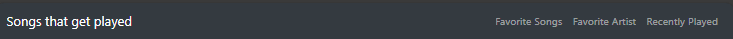

# Bootstrap

In this project I used what I learned from the last bootsrap project to
implement 1-2 pages with Bootstrap.

## Header

A header with a nav bar that collapses into a hamburger menu when screen size gets smaller

## Banner Section

In the banner section I put a collage of albums I listen too.

I also put a welcome message below the collage.

## Single Item Carousel

For the single item carousel I made a carousel of a couple of my favorite songs.

Clicking the arrows cycles between the two.

## Multiple Item Carousel

For the multiple item carousel I made a carousel of some of my favorite artist.

While on desktop no arrow is present, When shrinking the size down to tablet size the arrows will apear and 2 cards will be visible. Clicking the arrows will cycle through the 2 cards to the next 2 cards. Finally when on mobile size only one card at a time will be shown. When clicking the arrows each card will cycle through.

## Free Section/ Drop Down Menuse/ Aside Section

For this next section I did 3 sections in one

I wanted my free section to be something interseting so I made a drop down menu where you pick 1 of 3 genres and it will show the song related to that genre. I then used the Aside tag to have a Spotify play the song on the page.

## Footer

In the footer I Added images that link to my GitHub, Linkedin, and X.

Link to GitHub Pages: https://dacods.github.io/atlas-bootstrap/